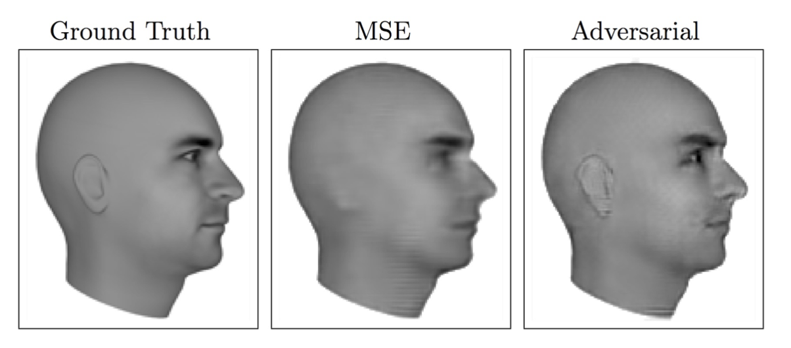
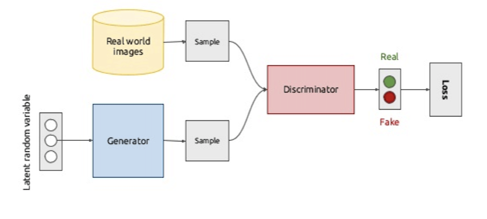
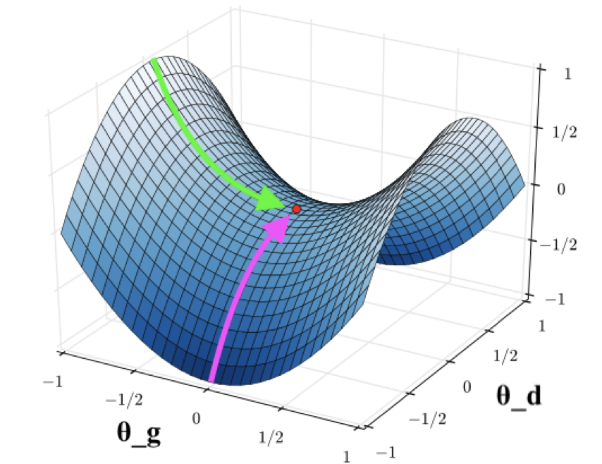
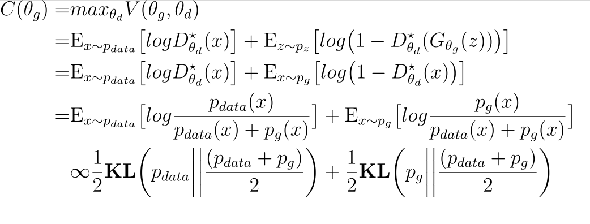
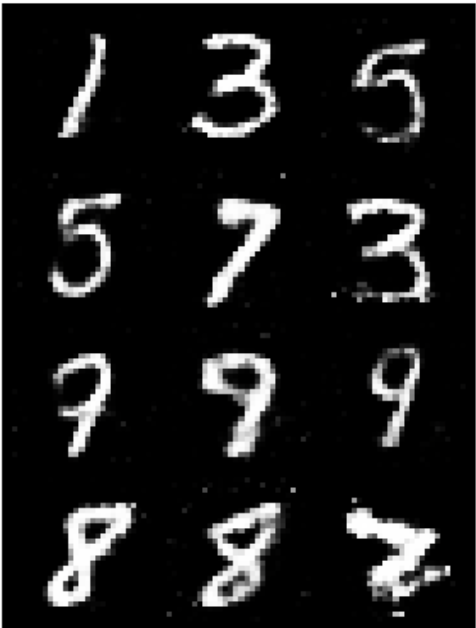
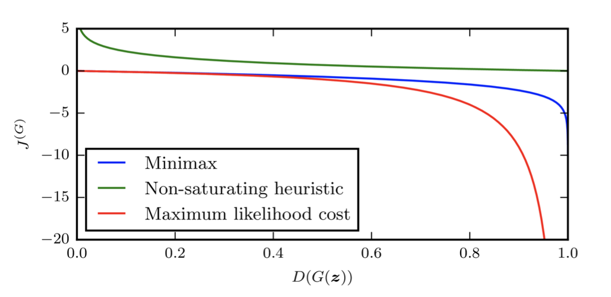
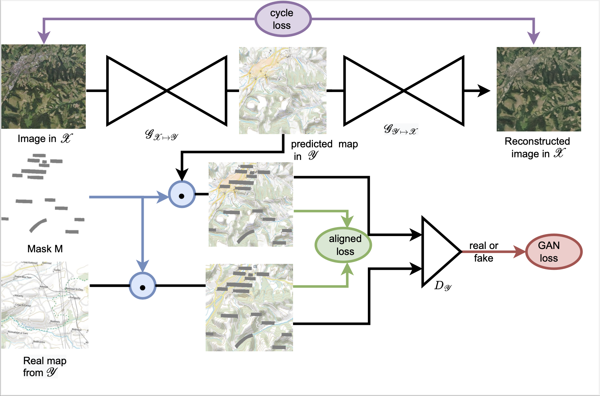

# Generative Adversarial Networks

This tutorial aims at describing Generative Adversarial Networks (GANs). It describes:
- Motivation on why to study generative models?
- How generative models work and the details of how GANs work?
- Implementation of GANs
- How to use GANs in practice with other applications?
- Further exercises

## Why to study generative models?

__Semi-supervised learning means more training data:__ we can train generative models with missing data and still outputs predictions. For example, in semi-supervised learning, the labels of some of the training examples are not available thus the algorithm requires a large number of unlabeled data (which is usually easy to obtain) to generalize well. Generative models including GANs can perform semi-supervised learning good enough.

__Diversity is desirable, multi-model outputs__ Some problems may have many right answers: a single input may have multiple answers that are acceptable. Example of such applications are caption generation and image to image translation.
Opposite to traditional training of machine learning algorithms (i.e. minimize the mean square error between the correct output and the model's predicted output), generative models can train models that can produce multiple different correct answers. Below is an example provided by Lotter et al (2015) of such scenario when predicting the next frame in a video. More information on this can be found [here](https://arxiv.org/pdf/1511.06380.pdf).

<table style="width:100%; table-layout:fixed;">
	<tr>
		<td></td>
	</tr>
</table>

__Realistic generative tasks__ require generating images that are realistic. One example of such tasks is image to image translation that can convert an aerial image into legible maps (will see a detailed example on how this can be done in section ) [How to use GANs in practice with other applications?](#How-to-use-GANs-in-practice-with-other-applications?).

## How generative models work and the details of how GANs work?

### Generative Models
Generative models are a class of statistical models that produce new data instances by estimating the probabilistic process from a set of observations. For supervised generative models, given a set of observations )_{i=1}^{n}), the generative model learns the joint probability distribution ) to compute ). Where as for the unsupervised generative models, given a set of observation _{i=1}^{n}), the generative model directly estimates ) by maximizing the likelihood of the training data  to learn the parameters of the model: )).

### Generative Adversarial Networks
Generative Adversarial Networks, or GANs, introduced by Goodfellow et al. are one of the most popular generative models. GANs introduce the concept of adversarial learning which consists of a discriminative model that learns to determine if a sample is from the model distribution (generated model) or from the data distribution (real data). This technique helps researchers in creating generated photos for people’s faces that look very realistic. GANs consists of training two neural networks: generator and discriminator. The generator generates data that comes from the same distribution of the training data by implicitly learning to model the true distribution and the discriminator checks whether the samples created are real or fake. The generator is trained to fool the discriminator by making fake data look real and the discriminator is trained to get better and better at distinguishing real data from fake one.

<table style="width:100%; table-layout:fixed;">
	<tr>
		<td></td>
	</tr>
</table>

The figure is taken from [here](https://cs.stanford.edu/~amishkin/assets/slides/gans.pdf).

__The generator__ is represented by a differentiable function . Given a sample  from a prior distribution ), we have ) where  is defined by its parameter .

__The discriminator__ is also a differentiable function that represents the probability that  comes from the data and is defined by its parameter , i.e. =Pr(x\sim&space;p_{data})).

__Training Process__ consists of simultaneous stochastic gradient descent training for both  and .  is trained to maximize the probability of assigning the correct label to both training examples and samples from .  is simultaneously trained to minimize ))). So, we can learn the both  and  via the minmax objective function ):  }[\log&space;D_{\theta_{d}}(x)]&plus;\mathrm{E}_{z\sim&space;p_{z}(z)}[\log(1-D_{\theta_{d}}(G_{\theta_{g}}(z)))]) (first part of the equation represents the likelihood of the true data and the second part represents the likelihood of the generated data).

This figure represents the optimization process and it is taken from [here](https://cs.stanford.edu/~amishkin/assets/slides/gans.pdf).

#### Saddle Point Optimization
For  is fixed (defining an implicit distribution )), the optimal discriminator   is =\frac{p_{data}(x)}{p_{data}(x)&plus;p_{g}(x)}).

__Proof (exercise 1):__

&=\int_{x}p_{data}(x)\log&space;D(x)dx&plus;\int_{z}p_{z}(z)\log(1-D(G(z)))dz\\&=\int_{x}p_{data}(x)\log&space;D(x)dx&plus;p_{g}(x)\log(1-D(x))dx\end{align*})
For any \in\mathbb{R}^{2}\setminus{0,0}), the function &plus;b\log(1-y)) achieves its maximum in  at .

Given an optimal discriminator ), the generator objective becomes:

where  is the Kullback–Leibler divergence.

Therefore, given an optimal discriminator, ) achieves its global minimum at .

__Sketch of the proof (exercise 2):__
For , , then . Subtract this expression from the value of , we get }{2}\bigg)&plus;\mathbf{KL}\bigg(p_{g}\bigg|\bigg|\frac{(p_{data}&plus;p_{g})}{2}\bigg)) and this is the Jensen–Shannon divergence between the model’s distribution and the data generating process, thus ). The Jensen–Shannon divergence between two distributions is always non-negative, and zero iff they are equal, then   is the global minimum of  and the only solution is .

## Implementation of GANs(exercise 3)

A jupyter notebook to implement this task is provided and can be directly launched in Google Colab from here: .
This is the outcome on the MNIST dataset:

## Problems with GANs

__Vanishing Gradients:__  the minmax objective function ) saturates when  is very close to perfect and then the generator gradient vanishes. One of the possible solution to this is to use a non-saturating heuristic objective for the generator, for example, =\mathrm{E}_{z\sim&space;p_{z}}\big[log\big(D_{\theta_{d}}(G_{\theta_{g}}(z))\big)\big]) or a maximum likelihood cost. Another possible solution is try balancing the training between  and  through schedule learning. Figure below is taken from [here](https://cs.stanford.edu/~amishkin/assets/slides/gans.pdf) illustrates the vanishing gradient problem.

<table style="width:100%; table-layout:fixed;">
	<tr>
		<td></td>
	</tr>
</table>

__Non Convergence:__  The gradient descent algorithm using in GANs is not guaranteed to converge for minimax objectives. One possible solution would be to use ADAM optimizer.  

##  How to use GANs in practice with other applications?

One application for GANs would be Adversarial Map Generation Framework (this project I have done during my master project), in which we consider the problem of automatically converting an aerial orthophotography into a legible map of arbitrary style. We address this task from an image-to-image translation perspective, and use both modern maps and historical maps spanning several centuries. Maps are inherently different from natural images: they rely on symbolic representations, contain text for named entities, and can be easily aligned with aerial images. We propose to exploit these unique properties to adapt the CycleGAN adversarial generative model for our problem. Our modifications significantly improve the legibility of generated maps.

<table style="width:100%; table-layout:fixed;">
	<tr>
		<td></td>
	</tr>

</table>

More information on this project can be found [here](https://github.com/dinalzein/pytorch-CycleGAN-and-pix2pix).

## Further exercises
In addition to the exercises provided in this tutorial, please solve the exercises in section 7 [here](https://arxiv.org/pdf/1701.00160.pdf). Solutions to these exercises are provided in section 8 in the same pdf.

## References and used materials
- [Goo+14] Ian Goodfellow et al. “Generative adversarial nets”. In: Advances in neural information processing systems 27 (2014).
- NIPS 2016 [tutorial's](https://arxiv.org/abs/1701.00160) on GANs by Ian Goodfellow.
- Aaron Mishkin's [presentation](https://cs.stanford.edu/~amishkin/assets/slides/gans.pdf) at UBC MLRG 2018
